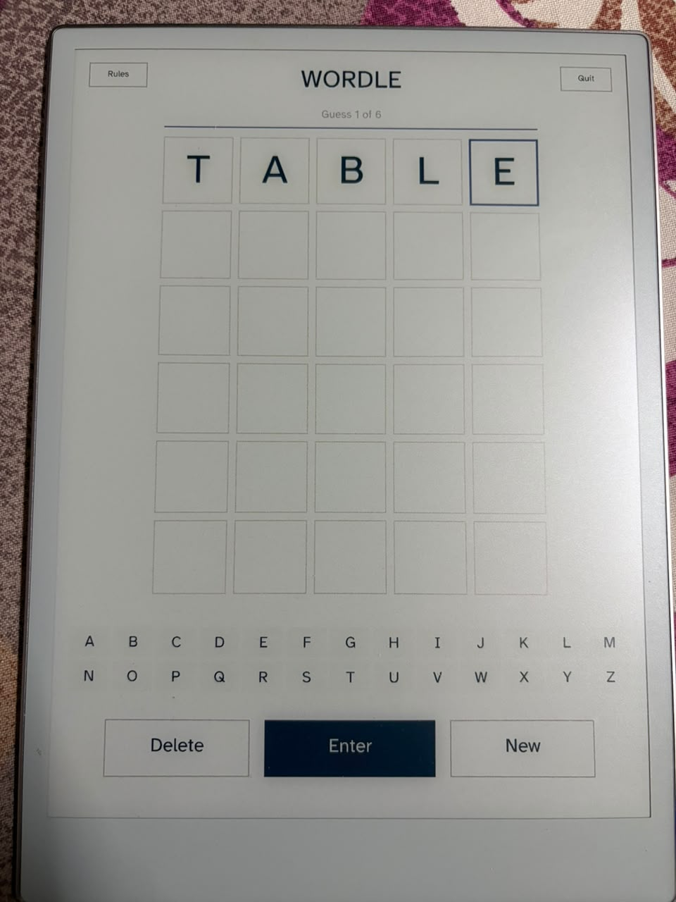
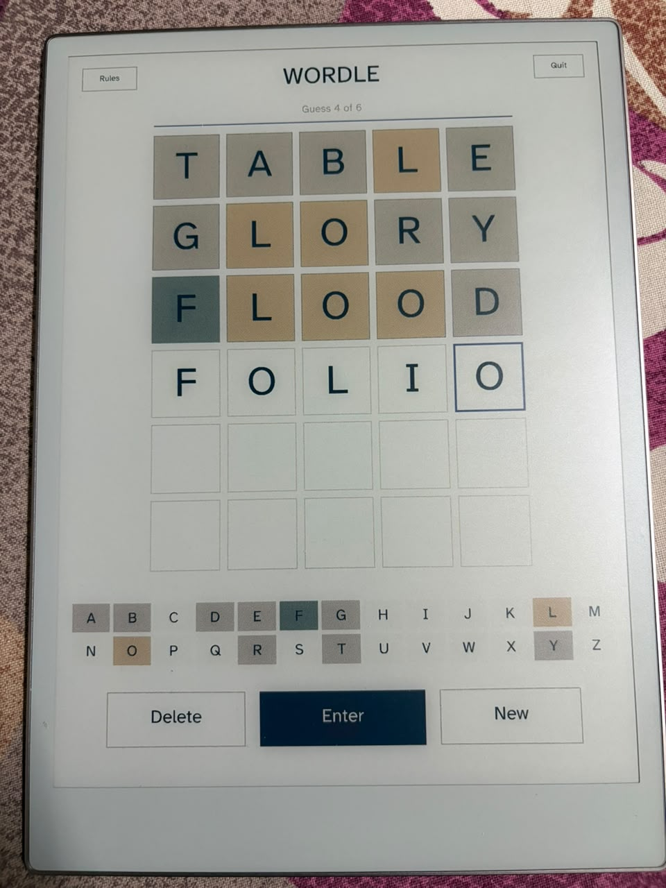
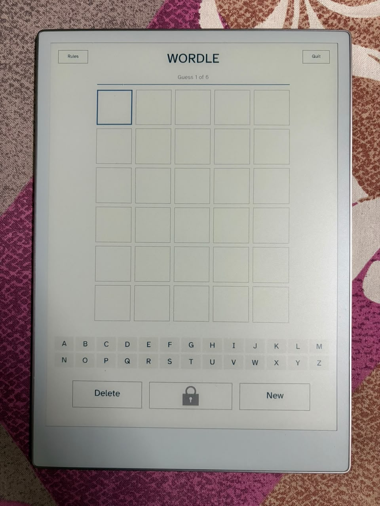
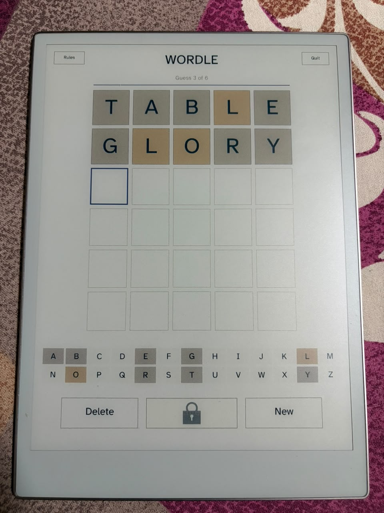
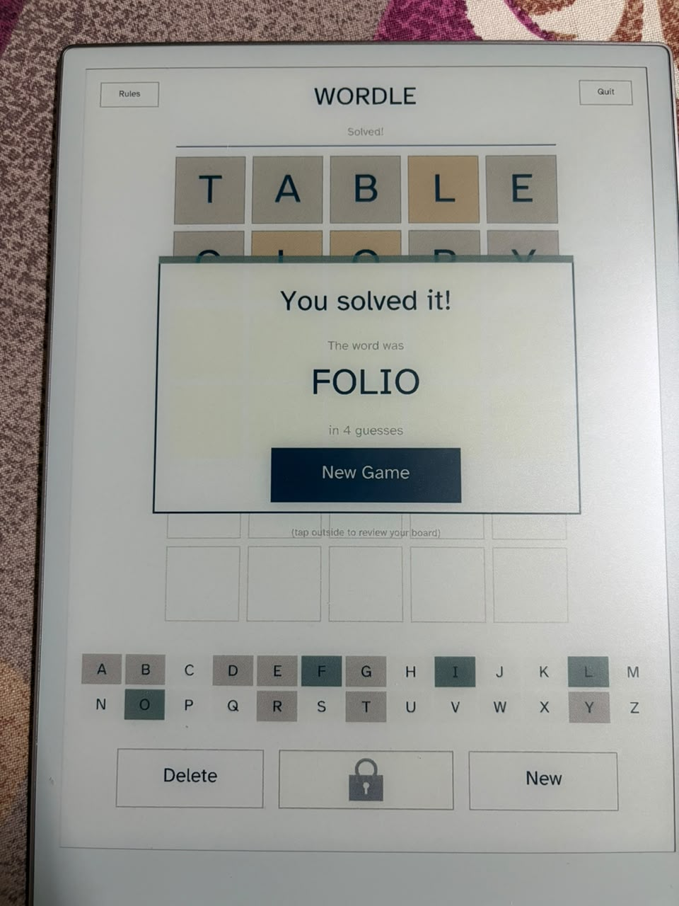
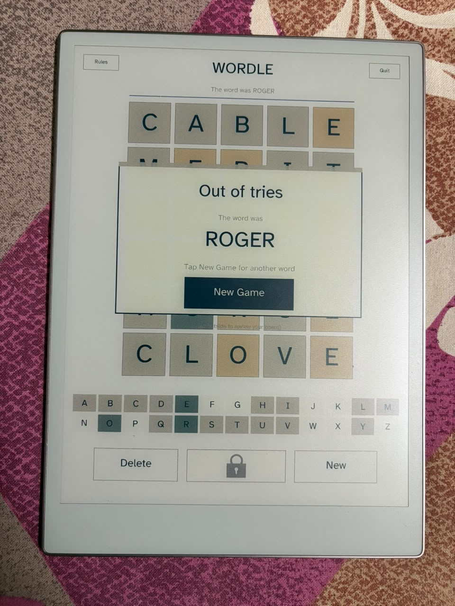
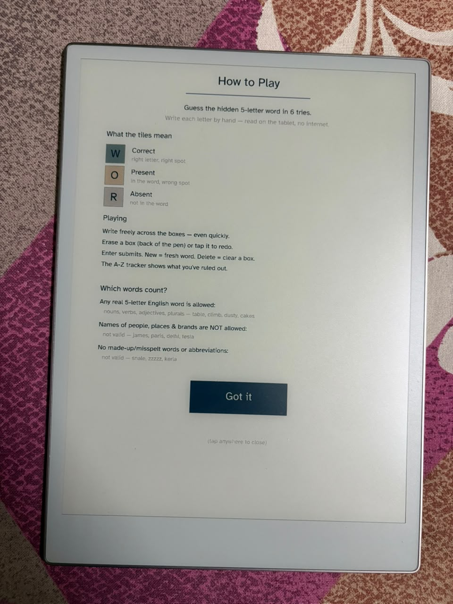

<div align="center">


# ✏️ InkWordle

### Write-by-hand Wordle for the reMarkable Paper Pro. No keyboard, no internet — you **write** each letter with the pen and the tablet reads your handwriting on-device.

**InkWordle** is a full-screen Wordle for the **reMarkable Paper Pro** that turns the word puzzle into something that belongs on paper. You don't tap keys — you write your guess into the grid in your own hand, and a tiny neural net **on the tablet itself** recognizes each letter in milliseconds. No account, no API key, no network. Just ink, paper, and a word to find.

<br>


<br>

<table>
<tr>
<td width="50%" align="center" valign="top">
<br>
<sub><b>Write your guess by hand…</b><br>Each letter goes straight into a box — no on-screen keyboard.</sub>
</td>
<td width="50%" align="center" valign="top">
<br>
<sub><b>…read on-device and scored in color.</b><br>Green, amber, gray — exactly like Wordle, on e-ink.</sub>
</td>
</tr>
</table>

</div>

---

## What it is

InkWordle is played the way the device wants to be used — **with the pen**. Six tries to find a hidden five-letter word. You write your guess into the row, letter by letter; after a short pause the tablet recognizes your handwriting, fills the boxes, and — when you press **Enter** — scores the guess with the familiar green / amber / gray tiles.

The whole thing runs **entirely on the tablet**. Recognition is a small [EMNIST](https://www.nist.gov/itl/products-and-services/emnist-dataset) convolutional network compiled to native ARM and run through [`tract`](https://github.com/sonos/tract) — **no large language model, no cloud call, no data ever leaving the device**. It reads a hand-written letter in a couple of milliseconds, so writing feels immediate.

It grew out of an on-device handwriting-recognition engine paired with **full-takeover e-ink rendering** — the pen and color panel are driven directly, so ink is instant and the colored tiles actually pop on Gallery 3.

---

## 📑 Table of contents

- [What it is](#what-it-is)
- [See it in action](#see-it-in-action) — real photos of the game on the tablet
- [Features](#features) — what makes it special
- [The interface & controls](#the-interface--controls) — every gesture and button
- [Requirements](#requirements)
- [Install](#install) — get it on your tablet in two steps
- [Settings](#settings) — the one optional tweak, via `remagic config`
- [How it works](#how-it-works) — the technical side, for the curious
- [The words](#the-words) — where the dictionary comes from
- [Build from source](#build-from-source)
- [Credits & lineage](#credits--lineage)
- [License](#license)

---

## See it in action

> Every picture below is a **real photo of the tablet** — the actual game running on e-ink, handwriting and all. Nothing is a mockup.

### A round, start to finish

<table>
<tr>
<td width="50%" align="center" valign="top">
<br>
<sub><b>A fresh board</b><br>Six rows, five boxes. The first cell glows blue — that's where you write. Enter shows a 🔒 until the row is full.</sub>
</td>
<td width="50%" align="center" valign="top">
<br>
<sub><b>Write the whole word by hand</b><br>Print each letter into its box. Digits are ignored and case doesn't matter — it reads them as lowercase letters.</sub>
</td>
</tr>
<tr>
<td width="50%" align="center" valign="top">
<br>
<sub><b>Scored in color</b><br>Green = right letter, right spot. Amber = in the word, wrong spot. Gray = not in the word. The A–Z tracker updates too.</sub>
</td>
<td width="50%" align="center" valign="top">
<br>
<sub><b>Each guess narrows it down</b><br>The tracker along the bottom colors every letter you've tried, so you always know what's left.</sub>
</td>
</tr>
</table>

### Win or lose — it lands with a flourish

<table>
<tr>
<td width="50%" align="center" valign="top">
<br>
<sub><b>You solved it!</b><br>A card pops with the word and how many guesses it took. Tap <b>New Game</b>, or tap outside to admire your board.</sub>
</td>
<td width="50%" align="center" valign="top">
<br>
<sub><b>Out of tries</b><br>No mystery about the answer — the word is revealed, and a fresh puzzle is one tap away.</sub>
</td>
</tr>
</table>

### Everything you need to know, on the tablet

<div align="center">
<br>
<sub><b>The built-in Rules screen</b> — the color legend, how to play, and exactly which words count. Tap <b>Rules</b> (top-left) any time.</sub>
</div>

---

## Features

### 🔒 100% local — nothing leaves your tablet
The star of the show. Your handwriting is read by a **character-recognition engine that lives entirely on the device** — there is no large language model, no server, no cloud, no internet connection anywhere in the loop. Nothing to sign into, no key to paste, no data sent anywhere. Turn on airplane mode and it plays exactly the same. The game, the recognizer, the dictionary and your history all sit on the tablet.

It's also **easy on the tablet**: with no radio spinning, no backlight, and e-ink that only redraws the pixels that change, it sits nearly idle between your guesses — the recognizer wakes for just a couple of milliseconds when you pause. It's a small local game, not a battery drain.

### ✍️ You play with the pen — no keyboard at all
- **Write into the grid.** Print each letter into its box with the pen and it appears as text. That's the whole input — there is **no on-screen keyboard** (the A–Z row at the bottom is a *tracker*, not keys).
- **Write as fast as you like.** Dash a whole word across the boxes in one flow — your ink shows instantly and the letters are recognized together after you pause, so it never stutters or jitters mid-word.
- **Fix a letter in a second.** Flip the pen and touch a box with the **eraser** to redo just that letter, or tap a box to clear it. The highlight then moves to the next empty box on its own.
- **Reads real handwriting.** Big or tiny, neat or rushed — your strokes are normalized before they're read, so it copes with the way people actually write. It's smart about look-alikes too (no `O`/`0`, `I`/`1`, `S`/`5` mix-ups) and only ever nudges a letter when it was genuinely unsure — never silently rewriting something you wrote clearly, and it tells you when it does help.

### 📖 A real Wordle — the whole thing
- **The genuine Wordle dictionary.** It ships with the real curated answer pool *and* the full permissive list of accepted guesses — so the hidden word is always fair and common, and any real word you type is accepted rather than wrongly rejected.
- **Everything the original has.** Six tries, exact **green / amber / gray** scoring (with proper repeated-letter handling), a live **A–Z letter tracker**, and win / lose results — all faithful to the game you know.
- **All the little precautions, done right.** Words **don't repeat** for a long stretch (remembered even across restarts); **New asks before discarding** a game in progress; the **exit is deliberate** so you never quit by accident; and the validity rules are fair and explained in-app.

### 🎨 A UI made for e-ink
- **Color tiles that pop** on the Gallery 3 color panel, with a clean, roomy grid.
- **A lock that becomes Enter** — the submit button shows a 🔒 padlock until all five letters are in, then turns into a solid **Enter**.
- **Result cards & a Rules screen** — a proper "You solved it!" / "Out of tries" pop-up, and a built-in how-to-play with the full color legend and word rules.
- **Instant, lag-free ink** — the pen and panel are driven directly, updating only the pixels that change, so writing feels immediate.

---

## The interface & controls

A slim top bar, the 6×5 grid, the A–Z tracker, and a three-button control bar — all driven by the **pen**, single-finger **taps**, and the **power button**. No keyboard.

### The top bar

| Control | What it does |
|---|---|
| **Rules** (left) | Opens the how-to-play overlay (color legend, tips, which words count). Tap anywhere to close. |
| **InkWordle** (center) | The title, with a status line below — *Guess 3 of 6*, *Solved!*, or *The word was …*. |
| **Quit** (right) | Leaves the game and returns to the launcher. |

### The control bar

| Button | What it does |
|---|---|
| **Delete** | Clears the focused box (or the last filled one). |
| **🔒 → Enter** | A padlock while the row is incomplete; a solid **Enter** once all five letters are in. Tap it to submit. |
| **New** | Starts a fresh word. Mid-game it asks to **confirm** first, so an accidental tap can't discard your progress. |

### Gestures & buttons — the full list

| Do this | Get this |
|---|---|
| **Write** a letter into a box, then **pause** | Your letters are recognized together and fill the boxes |
| **Write fast** across several boxes | Ink shows immediately; recognition catches up after the pause |
| **Eraser** (back of the pen) on a box | Wipes that one letter so you can rewrite it |
| **Tap** a box | Clears it for a rewrite |
| **Tap** Enter (once full) | Submits the guess and scores the row |
| **Tap** New | Starts a new game (confirms first if one is in progress) |
| **Tap** Rules / Quit | Opens the rules / leaves the game |
| **Power button** | Sleeps the tablet as usual |

> There is **no five-finger-quit gesture** — it was too easy to trigger by accident. Use the on-screen **Quit** button.

---

## Requirements

- A **reMarkable Paper Pro** (i.MX8MM / aarch64 — Ferrari / Chiappa / Tatsu). *Not* the reMarkable 1 or 2.
- **remagic** installed on the tablet (developer mode + the AppLoad launcher).
- **Nothing else.** No API key, no account, no internet connection — recognition is entirely on-device.

---

## Install

### Step 1 — Get remagic on your tablet

InkWordle runs on the **remagic** platform (xovi + AppLoad). If you haven't set it up yet, do that first — it's one command:

**→ [github.com/MaximeRivest/remagic](https://github.com/MaximeRivest/remagic)**

That turns on developer mode, installs the AppLoad launcher, and gives you the `remagic` CLI on your computer.

### Step 2 — Install InkWordle

> **Pointing to your tablet:** `remagic` finds it automatically — over the **USB** cable (address `10.11.99.1`) or over **Wi-Fi** once you've run `remagic wifi on`. To force a specific address, prefix any command with `remagic -host <ip> …`.

#### Option A — Prebuilt release (no compiler) ✅ recommended

1. Download **`inkwordle-<version>.zip`** from the [**Releases**](https://github.com/Rkcr7/inkwordle/releases/latest) page and unzip it — you get an `inkwordle/` folder.
2. With the tablet connected, push it into AppLoad:
   ```sh
   remagic install ./inkwordle
   ```
3. On the tablet: open **AppLoad → Reload → InkWordle**.

#### Option B — Build from source

Docker does the cross-compile (no Rust setup on your machine). From the repo root, tablet connected:

```sh
bash build.sh                                 # cross-build quill + the game (Docker)
remagic install game/dist/inkwordle           # push the staged bundle to the tablet
```

Then **AppLoad → Reload → InkWordle**.

> **If the app doesn't appear after Reload**, a folder copy can drop an executable bit on the launcher. Restore it once over SSH (USB) — then Reload again:
> ```sh
> ssh root@10.11.99.1 'cd /home/root/xovi/exthome/appload/inkwordle && chmod 755 inkwordle *.sh libquill.so'
> ```

That's it — no key, no config. Open **InkWordle** and start writing.

---

## Settings

**InkWordle needs no configuration to play** — install it and start writing. There's exactly one optional tweak: how long the pen must rest before your letters are read. Bump it up if you write slowly, or lower it for a snappier feel.

To change it, run this on your computer with the tablet connected:

```sh
remagic config inkwordle
```

`remagic config` opens a small settings form **in your browser** and also prints a **QR code** — scan it to fill the form from your phone instead. Adjust the value, hit save, and you're done. It writes your choice to a `settings.env` file next to the app on the tablet, which **persists across reboots and reinstalls** (updating the app never overwrites it). Re-run the same command any time to change it again.

| Setting | Default | What it does |
|---|---|---|
| `INKWORDLE_IDLE_MS` | `900` | Milliseconds the pen must pause before your written letters are recognized. Higher = more time to write across boxes before it commits; lower = snappier. |

---

## How it works

```
   your pen ──▶ per-box ink ──▶ EMNIST model (tract, on ARM) ──▶ letters ──▶ dictionary + scoring
       │                                                                          │
   color e-ink panel ◀──────────── Quill (vendor waveform engine) ◀── colored tiles + tracker + cards
```

- **Full-takeover rendering.** While InkWordle is open it takes over the display and drives the Gallery 3 color panel directly through the vendor waveform engine (via **Quill**) — instant ink and real color, not the usual UI refresh. Updates are tiny dirty rectangles, so nothing flickers.
- **Per-box handwriting capture.** Each grid cell keeps its own ink buffer. Strokes are captured thin, then cropped to the letter, scaled to a fixed size, and thickness-normalized — so recognition is size- and pressure-invariant.
- **On-device recognition.** A small EMNIST convolutional network (ONNX) runs through `tract`'s pure-Rust engine, cross-compiled to native aarch64. Each letter is read in a few milliseconds. The output is softmaxed, digit classes are masked, and upper/lowercase pairs are merged into 26 lowercase letters with a confidence for each.
- **Scoring & dictionary.** Standard two-pass Wordle scoring (greens first, then presents, with correct duplicate-letter handling). If a guess isn't a valid word, a conservative, confidence-gated auto-correct tries a single well-justified substitution before the guess is rejected.
- **On-device memory.** A short list of recent answers is stored in your home directory so words don't repeat for a long stretch, even across restarts.

Everything — the game, the model, the fonts, the word lists — ships in one self-contained bundle. Module map lives in [`game/src/`](game/src): `main.rs` (app loop + input), `game.rs` (scoring, validity, auto-correct), `render.rs` (all drawing + layout), `engine.rs` / `preprocess.rs` (the recognizer), `history.rs` (no-repeat memory), and the `quill/` display host.

---

## The words

The dictionary is the real thing, split into two lists (both in [`game/assets`](game/assets)):

- **Answers** — a curated pool of common, fair five-letter words. Only these are ever chosen as the hidden word, so the target is always something you'd recognize.
- **Valid guesses** — a much larger permissive list of accepted words. These are never shown as answers; they exist only so that a real word you happen to type isn't wrongly rejected.

Every answer is also a valid guess. The lists were cross-checked against several well-known open word sets (the classic Wordle answer/allowed lists, ENABLE, dwyl, and frequency data) so that answers stay common and guesses stay permissive. Pure proper nouns and non-words are excluded from answers; the in-app **Rules** screen explains exactly what counts.

---

## Build from source

The one dependency is Docker (it holds the reMarkable cross-toolchain). The loop:

```sh
bash build.sh                       # cross-build quill + the game (aarch64), stage the bundle
remagic install game/dist/inkwordle    # push to the tablet
```

Run the unit tests (scoring, validity, auto-correct, the no-repeat picker) inside the same image:

```sh
docker run --rm -v "$PWD:/work" muse-xbuild:latest \
  bash -lc "cd /work/game && cargo test --bin inkwordle"
```

---

## Credits & lineage

**InkWordle is built on, and for, the [remagic](https://github.com/MaximeRivest/remagic) platform** — it wouldn't exist without the people who opened this device up and made it programmable. If you enjoy InkWordle, please go star their work; the credit is theirs.

### The platform this runs on

- **[remagic](https://github.com/MaximeRivest/remagic)** by **[Maxime Rivest](https://github.com/MaximeRivest)** — the one-command platform (developer mode, the AppLoad launcher, the `remagic` CLI and Store). InkWordle is installed with `remagic install` and runs entirely within remagic. This project is fundamentally based on it.
- **[xovi](https://github.com/asivery/xovi)**, **[rm-appload](https://github.com/asivery/rm-appload)** and **epfb-re** by **[asivery](https://github.com/asivery)** — the function-hooking loader, the app host, and the e-ink framebuffer interposition shim. The **Quill** takeover display host that InkWordle draws through is built directly on asivery's epfb-re.

### The engine that reads your handwriting

- **[tract](https://github.com/sonos/tract)** by **Sonos** — the pure-Rust neural-network runtime that runs the recognizer natively on the tablet's ARM chip, with no cloud.
- **[EMNIST](https://www.nist.gov/itl/products-and-services/emnist-dataset)** (NIST) — the handwritten-character dataset the recognizer was trained on.

### The game

- **[Wordle](https://www.nytimes.com/games/wordle/index.html)** by **Josh Wardle** — the original that InkWordle lovingly recreates for paper. This is a non-commercial fan project, not affiliated with or endorsed by Wordle / The New York Times.

And, of course, **reMarkable** for the extraordinary paper-like device (and the developer SDK).

---

## License

**MIT** — see [LICENSE](LICENSE). InkWordle installs and builds on third-party software under their own licenses and does not redistribute reMarkable's proprietary components.

## Disclaimer

Not affiliated with reMarkable, or with Wordle / The New York Times. Developer mode and third-party software are used at your own risk. This app avoids the bootloader and your encrypted data and is designed to be reversible, but you are responsible for your device.

<div align="center">
<br>
<sub>Six tries. One pen. No keyboard. ✏️</sub>
</div>
